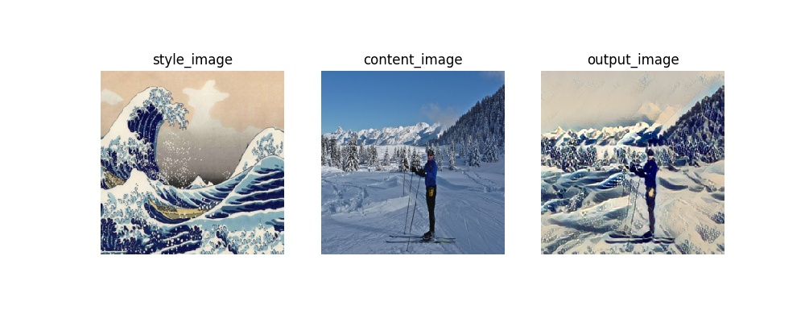
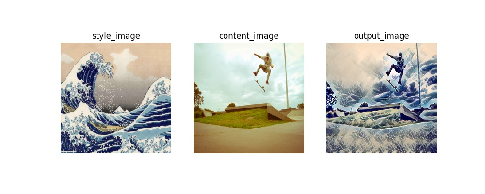
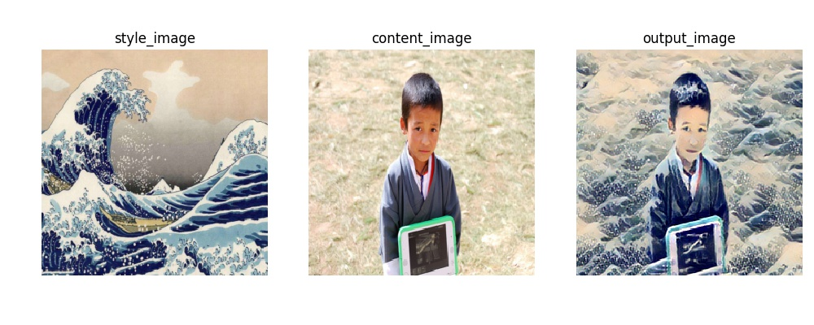

# Image Stylization 

Image stylization is to combine a real image as a base content with the perceptual context of a style image to a final stylized image.

## Overview 

Up to now, I tried two methods to stylize images. 

- [The first version](#the-first-trial)
- [The second version](#the-second-trial)

### Dataset

For the second method, it is trained on [COCO2014](http://cocodataset.org/#download)

### Prerequisites

| **Package** | **version** |
|-------------|-------------|
| python      | 3.5.2       |
| torch       | 1.0.1       |
| torchvision | 0.2.2       |
| tqdm		  | 4.19.9      |

### Getting Started

#### Train

```python
# train on the first method
python train.py
# train on the second method
python train2.py
```

#### Test

# test on specified image

```python
# test on specified images
python test.py
```

argument parser is coming soon.. 


## The first trial

This project is an implementation of [A Neural Algorithm of Artistic Style](https://arxiv.org/abs/1508.06576). 

### Introduction

The core idea of it is to interpret the gram matrix as style loss to express the perceptual and cognitive mode of style image while leverage the tradeoff between the loss from the origin content image.

The trainable parameters contains only the pixel value of final output image.

### Result

<table>
    <tr>
        <td></td>
        <td></td>
        <td></td>
    </tr>
</table>

## The second trial

This project is an implentation of [Perceptual Losses for Real-Time Style Transfer and Super-Resolution](https://arxiv.org/abs/1603.08155)

### Introduction

Different with the first trial, the generation of this method is based on the transform net. In particular, it is composed of downsampling with CNN network, residual blocks and upsampling parts using nearest padding, therefore it can be implemented in real-time according to various content-image.

Further more, total variation loss is used to smooth the final image.

### Training time

Training for 1 epoch of 32000 images in batch size of 4 costs around 2 hours and 40 minutes on one K80(12GB) GPU.

### Resource

`state_dict`(weights) of the model can be fetched from [My Google drive](https://drive.google.com/file/d/1Ciw3eqa16LCOLlpdDeO4hwLdbfsxnOn-/view?usp=sharing)

### Result






### Reference

- [A Neural Algorithm of Artistic Style](https://arxiv.org/abs/1508.06576)
- [Image Style Transfer Using Convolutional Neural Networks](https://www.cv-foundation.org/openaccess/content_cvpr_2016/papers/Gatys_Image_Style_Transfer_CVPR_2016_paper.pdf)
- [Instance Normalization, The Missing Ingredient for Fast Stylization](https://arxiv.org/pdf/1607.08022)
- [Meta Networks for Neural Style Transfer](http://openaccess.thecvf.com/content_cvpr_2018/papers/Shen_Neural_Style_Transfer_CVPR_2018_paper.pdf)
